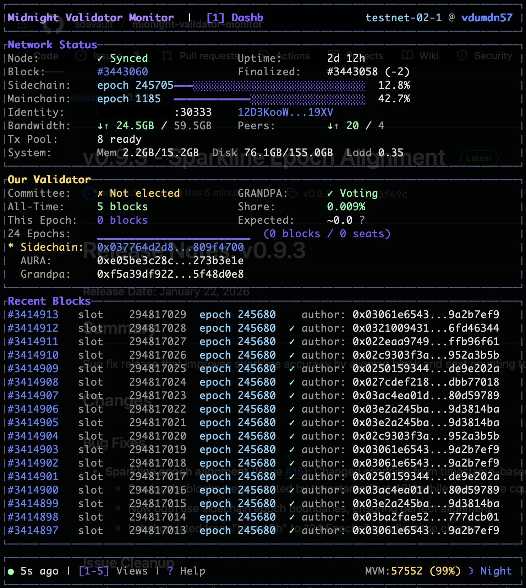

# Midnight Validator Monitor (MVM)

A production-ready Rust CLI tool for monitoring and managing Midnight blockchain validator nodes.



## Features

- **Status Monitoring**: Node health, sync status, peer count, block production
- **Block Synchronization**: Continuous sync daemon with systemd integration
- **Interactive TUI**: Real-time monitoring dashboard with multiple views, 48h sparkline, and performance alerts
- **System Monitoring**: Optional node_exporter integration for Memory, Disk, and Load metrics
- **Data Queries**: Query synced blocks, validator performance, and detect gaps
- **Key Management**: Verify keystore loading and registration status
- **Configuration**: TOML-based config with environment variable overrides
- **Shell Completions**: Tab completion for bash, zsh, fish, powershell, elvish
- **Daemon Mode**: Graceful shutdown, PID management, auto-restart

## Installation

### Quick Install (Recommended)

Requires Rust 1.70+

```bash
# Build release binary
cargo build --release

# Install as system service
sudo ./scripts/install.sh
```

This installs to `/opt/midnight/mvm/` and creates systemd services running as your user.

### Manual Build Only

```bash
cargo build --release
./target/release/mvm --help
```

### Starting Systemd Services

After installation, start the sync daemon:

```bash
# Start continuous block sync
sudo systemctl start mvm-sync
sudo systemctl enable mvm-sync

# (Optional) Enable periodic health checks
sudo systemctl enable --now mvm-status.timer
```

### Configuration

Edit `/opt/midnight/mvm/config/config.toml`:

```toml
[rpc]
url = "http://localhost:9944"
# Optional: node_exporter for system metrics (Memory, Disk, Load)
node_exporter_url = "http://localhost:9100/metrics"

[database]
path = "/opt/midnight/mvm/data/mvm.db"

[validator]
keystore_path = "/path/to/your/keystore"

[sync]
batch_size = 100
poll_interval_secs = 6
```

See `mvm config example` for full configuration options.

## Requirements for Key Verification

To verify that keys are loaded in the node's keystore, the node must allow `author_*` RPC methods. By default, these are blocked for security. To enable:

```bash
# Start your node with unsafe RPC methods enabled
midnight-node --rpc-methods=unsafe ...
```

Without this, key status will show `?` (unable to verify) but registration checks will still work.

## Commands

### status - Monitor validator node

Display current validator node status with health checks and key verification.

```bash
# Basic monitoring (runs every 60s)
mvm status --keystore /path/to/keystore

# Single check
mvm status --once --keystore /path/to/keystore

# Custom endpoints
mvm status \
  --rpc-url http://localhost:9944 \
  --metrics-url http://localhost:9615/metrics \
  --keystore /path/to/keystore \
  --interval 30
```

| Flag | Short | Description | Default |
|------|-------|-------------|---------|
| `--rpc-url` | `-r` | Node RPC endpoint | `http://localhost:9944` |
| `--metrics-url` | `-M` | Prometheus metrics endpoint | `http://localhost:9615/metrics` |
| `--keystore` | `-K` | Path to Substrate keystore directory | - |
| `--keys-file` | `-k` | Path to keys JSON file (alternative) | - |
| `--interval` | `-i` | Monitoring interval in seconds | `60` |
| `--once` | - | Run once and exit | `false` |

### sync - Synchronize blocks to database

Fetch blocks from the node and store in a local SQLite database. Can run as a daemon via systemd.

```bash
# Sync blocks (uses config file paths)
mvm sync

# Sync from specific block
mvm sync --start-block 1000000

# Custom batch size and poll interval
mvm sync --batch-size 50 --poll-interval 10

# Daemon mode (use systemd instead for production)
mvm sync --daemon --pid-file /opt/midnight/mvm/data/mvm-sync.pid

# Only sync finalized blocks
mvm sync --finalized-only
```

| Flag | Short | Description | Default (from config) |
|------|-------|-------------|-----------------------|
| `--rpc-url` | `-r` | Node RPC endpoint | `http://localhost:9944` |
| `--db-path` | `-d` | SQLite database path | `/opt/midnight/mvm/data/mvm.db` |
| `--start-block` | `-s` | Block number to start from | auto |
| `--batch-size` | `-b` | Blocks per batch | `100` |
| `--finalized-only` | - | Only sync finalized blocks | `false` |
| `--poll-interval` | - | Seconds between new block checks | `6` |
| `--daemon` | - | Run as background daemon | `false` |
| `--pid-file` | - | PID file path (daemon mode) | - |

### query - Query stored block data

Query the synced database for statistics, blocks, validators, and performance metrics.

```bash
# Show database statistics (uses config file db path)
mvm query stats

# List recent blocks
mvm query blocks --limit 20

# List validators with performance stats
mvm query validators --limit 20

# Show only our validators
mvm query validators --ours

# Show performance rankings
mvm query performance --limit 10

# Find gaps in synced data
mvm query gaps
```

| Subcommand | Description |
|------------|-------------|
| `stats` | Show database statistics (total blocks, finalized, gaps) |
| `blocks` | List blocks with slot, epoch, extrinsics count, author |
| `validators` | List all validators with block production stats |
| `validator <KEY>` | Show details for a specific validator |
| `performance` | Show top validators ranked by blocks produced |
| `gaps` | Find missing blocks in the synced range |

### keys - Verify session keys

Display and verify validator session keys from the keystore. The verify command also shows block production statistics if a database is available.

```bash
# Show keys from keystore (uses config file keystore path if set)
mvm keys show

# Verify keys are loaded and registered (shows block stats)
mvm keys verify --keystore /path/to/keystore

# Verify with custom paths
mvm keys verify \
  --keystore /path/to/keystore \
  --rpc-url http://localhost:9944 \
  --db-path /opt/midnight/mvm/data/mvm.db
```

| Subcommand | Description |
|------------|-------------|
| `show` | Display sidechain, aura, and grandpa public keys |
| `verify` | Check keys are loaded, registration status, and block production stats |

The `verify` command will:
- Check if keys are loaded in the node's keystore
- Verify registration status (permissioned or registered)
- Mark the validator as "ours" in the database
- Show block production statistics (total blocks, rank, recent blocks)

### view - Interactive TUI

Launch an interactive terminal UI for real-time monitoring.

```bash
# Launch TUI (uses config file paths by default)
mvm view

# Custom endpoints and database
mvm view --rpc-url http://localhost:9944 --db-path ./mvm.db
```

**Views:**
- `1` - Dashboard: Network status, epoch progress, validator info, recent blocks
- `2` - Blocks: Scrollable block list with author attribution
- `3` - Validators: All validators with block production stats
- `4` - Performance: Top validators ranked by blocks produced
- `5` - Peers: Connected peers with sync status and IP addresses
- `?` - Help: Keyboard shortcuts and field explanations (scrollable)

**Controls:**
- `1-5` - Switch views
- `j/k` or `↑/↓` - Scroll up/down (single line)
- `J/K` or `PgUp/PgDn` - Scroll up/down (page)
- `f` - Toggle "ours only" filter
- `t` - Toggle theme (Midnight/Midday)
- `?/h/F1` - Show help
- `q/Esc` - Quit

### config - Configuration management

Manage configuration files and view effective settings.

```bash
# Show current configuration
mvm config show

# Validate config file
mvm config validate

# Print example configuration
mvm config example

# Show config file search paths
mvm config paths
```

Configuration priority: CLI flags > Environment variables > Config file > Defaults

## Output Examples

### status command

```
INFO Health: ✓ | Syncing: ✓ | Peers: 12
INFO Block: 3349667 | Finalized: 3349665 | Sync: 100.00%
INFO Blocks produced: 1
INFO Sidechain: epoch 245624 slot 294749055 | Mainchain: epoch 1178 slot 101838307
INFO Keys: sidechain ✓ | aura ✓ | grandpa ✓
INFO Registration: ✓ Registered (valid)
```

### sync command

```
INFO Starting block synchronization
INFO Chain tip: 3352077, finalized: 3352075
INFO Starting sync from block 3351077
INFO Synced blocks 3351077-3351176 (100 blocks)
INFO Initial sync complete. 1001 blocks in database
INFO Watching for new blocks (poll interval: 6s)
INFO New block: 3352078-3352078 (1 synced)
```

### query stats

```
INFO Database Statistics
INFO Total blocks:     1003
INFO Finalized blocks: 1001
INFO Unfinalized:      2
INFO Block range:      3351077 - 3352079
INFO Gaps:             None (continuous)
```

### keys verify

```
INFO Key Status:
INFO   Sidechain: ✓ Loaded in keystore
INFO   Aura:      ✓ Loaded in keystore
INFO   Grandpa:   ✓ Loaded in keystore
INFO Registration Status:
INFO   ✓ Registered (valid)
INFO Summary: ✓ All keys loaded and registered
```

## Registration Status Types

| Status | Meaning |
|--------|---------|
| `✓ Permissioned candidate` | In the static permissioned validators list |
| `✓ Registered (valid)` | Dynamically registered with valid stake |
| `⚠ Registered but INVALID` | Registered but stake/signature validation failed |
| `✗ Not registered` | Not found in any registration list |

## Architecture

```
src/
├── main.rs              # CLI entry point with subcommands
├── commands/
│   ├── status.rs        # Status monitoring command
│   ├── sync.rs          # Block synchronization with daemon mode
│   ├── query.rs         # Database query command
│   ├── keys.rs          # Key verification command
│   ├── view.rs          # Interactive TUI command
│   └── config.rs        # Configuration management
├── rpc/
│   ├── client.rs        # JSON-RPC 2.0 client
│   └── types.rs         # Response data structures
├── db/
│   ├── schema.rs        # SQLite schema definitions
│   └── blocks.rs        # Block and validator CRUD operations
├── midnight/
│   ├── digest.rs        # AURA slot extraction from block digest
│   ├── keystore.rs      # Substrate keystore loading
│   ├── registration.rs  # Validator registration checks
│   ├── scale.rs         # SCALE decoding for AuraApi_authorities
│   ├── timing.rs        # Network timing and epoch calculations
│   └── validators.rs    # Validator set and committee management
├── tui/
│   ├── app.rs           # TUI application state
│   ├── event.rs         # Keyboard event handling
│   ├── layout.rs        # Responsive layout system
│   ├── theme.rs         # Color themes (Midnight/Midday)
│   └── ui.rs            # View rendering logic
├── config.rs            # TOML configuration system
├── daemon.rs            # PID file and daemon management
└── metrics.rs           # Prometheus metrics parser
```

Additional files:
```
scripts/
├── install.sh           # System installation script
└── uninstall.sh         # Uninstallation script
systemd/
├── mvm-sync.service     # Continuous sync daemon
├── mvm-status.service   # One-shot health check
└── mvm-status.timer     # Periodic health check timer
```

## Database Schema

The sync command creates a SQLite database with:

- **blocks**: Block number, hash, slot, epoch, extrinsics count, finalization status, author attribution
- **validators**: Validator keys (sidechain, aura, grandpa), registration status, block production counts, first seen epoch
- **sync_status**: Current sync progress and chain state (singleton table)

Validators are automatically tracked during sync, with block authors attributed to their sidechain keys. The `keys verify` command marks validators as "ours" for easy filtering.

## RPC Methods Used

**Standard Substrate:**
- `system_health` - Node health and peer count
- `system_version` - Node version
- `system_syncState` - Sync progress
- `chain_getHeader` - Current block header
- `chain_getBlock` - Full block with extrinsics
- `chain_getBlockHash` - Block hash by number
- `chain_getFinalizedHead` - Finalized block hash
- `author_hasKey` - Check if key is in keystore (requires `--rpc-methods=unsafe`)

**Midnight-Specific:**
- `sidechain_getStatus` - Epoch/slot info for both chains
- `sidechain_getAriadneParameters(mainchain_epoch)` - Validator registration data and permissioned candidates

## Monitoring and Management

### Check Service Status

```bash
# View sync daemon status
sudo systemctl status mvm-sync

# View logs
sudo journalctl -u mvm-sync -f

# Restart sync daemon
sudo systemctl restart mvm-sync
```

### Upgrading

```bash
# Stop services
sudo systemctl stop mvm-sync

# Build and install new version
cargo build --release
sudo ./scripts/install.sh

# Restart services
sudo systemctl start mvm-sync

# Verify
mvm --version
```

### Uninstallation

```bash
sudo ./scripts/uninstall.sh
```

## Documentation

- `README.md` - This file, main usage documentation
- `DEPLOYMENT.md` - Detailed deployment guide with systemd setup
- `CLAUDE.md` - Architecture and implementation details for developers
- `RELEASE_NOTES_v0.7.0.md` - Current release notes
- `docs/BACKLOG.md` - Future feature plans and known issues
- `docs/BLOCK_ATTRIBUTION.md` - Block author attribution design
- `docs/archive/` - Historical planning and research documents

## Changelog

### v0.8.0 (Current)
- **48-hour sparkline** with blocks/seats performance tracking and color-coded alerts
- **System resource monitoring** via optional node_exporter integration (Memory, Disk, Load)
- **Help screen glossary** with 10 Substrate/Midnight term definitions
- Improved dashboard layout with better column alignment
- Full-width epoch progress bars (30 characters)
- Bandwidth and Peers grouped together in Network Status panel

### v0.7.0
- Sparkline block production visualization on dashboard
- Shell completions for bash, zsh, fish, powershell, elvish (`mvm completions <shell>`)
- Page scrolling with J/K (uppercase) or PageUp/PageDown
- Help screen scrollbar indicator
- Block timestamps calculated from slot number (accurate historical times)
- Network timing module for epoch calculations
- Security review completed
- Fixed config paths and updated example configuration

### v0.6.1
- Fixed expected block prediction (was 2x too high)
- Fixed validator "is_ours" status being lost after epoch changes
- Fixed block author attribution on pruned nodes
- Added external IP filtering via `view.expected_ip` config option
- Dynamic TUI version display

### v0.6.0
- New Peers view (key 5) showing connected peers with sync status and IP addresses
- Dashboard enhancements: external IP, peer ID, node version, Grandpa voter status
- Separate sidechain (2h) and mainchain (24h) epoch progress bars
- "This Epoch" blocks now correctly tracks sidechain epoch (committee rotation cycle)
- Scrollable help screen with field explanations
- Improved labels and UI alignment throughout
- Code quality improvements (clippy fixes)

### v0.5.1
- TUI polish: layout simplification, improved epoch display
- Fixed "This Epoch" block counting bug
- Renamed "Our Validators" to "Our Validator" in TUI
- Two responsive layouts (Medium < 120 cols, Large >= 120 cols)

### v0.5.0
- Fixed critical block attribution bug - now uses actual 1200-seat committee
- SCALE decoding of AuraApi_authorities for correct committee data
- Fallback support for non-archive nodes

### v0.4.0-beta
- Committee snapshot storage for historical accuracy
- Author attribution to sidechain keys
- Performance improvements

### v0.3.0-alpha
- Interactive TUI with Dashboard/Blocks/Validators/Performance views
- Daemon mode with systemd integration

## License

MIT
